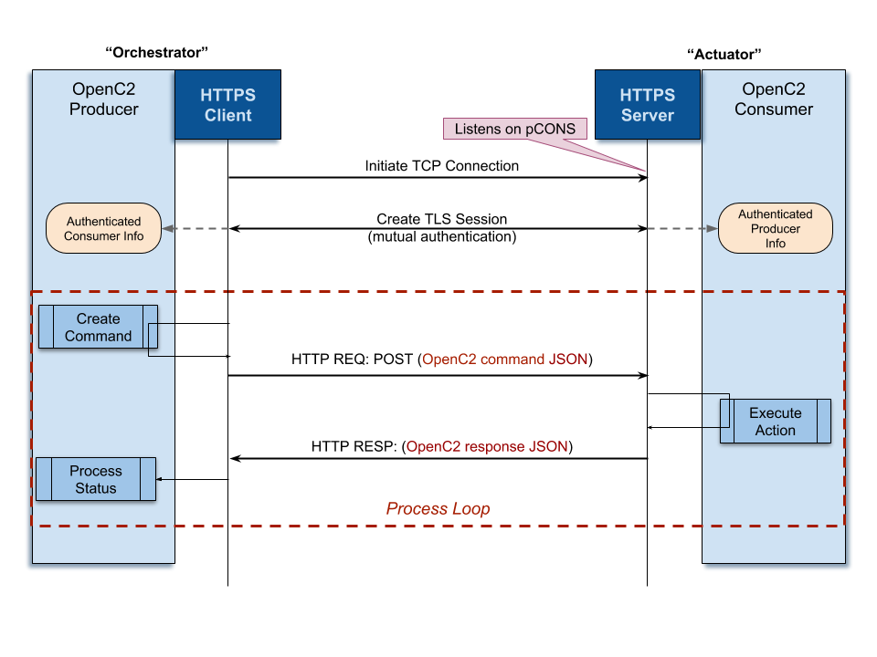
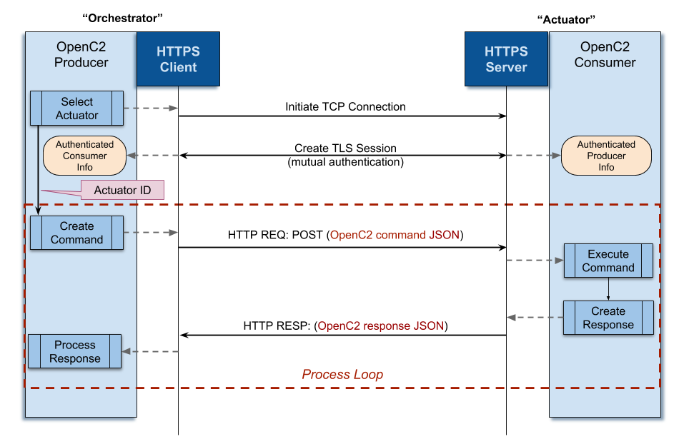
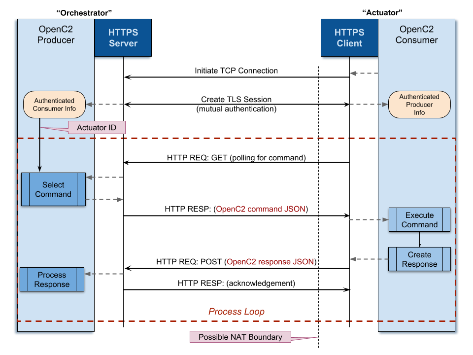

---

# Specification for Transfer of OpenC2 Messages via HTTPS Version 1.0
## Working Draft 01
## 09 August 2018
#### Specification URIs
##### This Version:
[http://docs.oasis-open.org/openc2/open-impl-https/v1.0/csd01/open-impl-https-v1.0-csd01.md](http://docs.oasis-open.org/openc2/open-impl-https/v1.0/csd01/open-impl-https-v1.0-csd01.md) (Authoritative)

[http://docs.oasis-open.org/openc2/open-impl-https/v1.0/csd01/open-impl-https-v1.0-csd01.html](http://docs.oasis-open.org/openc2/open-impl-https/v1.0/csd01/open-impl-https-v1.0-csd01.html)

[http://docs.oasis-open.org/openc2/open-impl-https/v1.0/csd01/open-impl-https-v1.0-csd01.pdf](http://docs.oasis-open.org/openc2/open-impl-https/v1.0/csd01/open-impl-https-v1.0-csd01.pdf)

##### Previous Version:
N/A

##### Latest Version:
[http://docs.oasis-open.org/openc2/open-impl-https/v1.0/open-impl-https-v1.0.md](http://docs.oasis-open.org/openc2/open-impl-https/v1.0/open-impl-https-v1.0.md) (Authoritative)

[http://docs.oasis-open.org/openc2/open-impl-https/v1.0/open-impl-https-v1.0.html](http://docs.oasis-open.org/openc2/open-impl-https/v1.0/open-impl-https-v1.0.html)

[http://docs.oasis-open.org/openc2/open-impl-https/v1.0/open-impl-https-v1.0.pdf](http://docs.oasis-open.org/openc2/open-impl-https/v1.0/open-impl-https-v1.0.pdf)

##### Technical Committee:
[OASIS Open Command and Control (OpenC2) TC](https://www.oasis-open.org/committees/openc2/)

##### Chairs:
* Joe Brule ([jmbrule@nsa.gov](mailto:jmbrule@nsa.gov)), [National Security Agency](https://www.nsa.gov/)
* Sounil Yu ([sounil.yu@bankofamerica.com](mailto:sounil.yu@bankofamerica.com)), [Bank of America](http://www.bankofamerica.com/)

##### Editor:
* David Lemire ([dave.lemire@g2-inc.com](mailto:dave.lemire@g2-inc.com)), [G2, Inc.](http://www.g2-inc.com/))

##### Additional artifacts:
This prose specification is one component of a Work Product that also includes:  

* XML schemas: [http://docs.oasis-open.org/openc2/open-impl-https/v1.0/csd01/schemas/](http://docs.oasis-open.org/openc2/open-impl-https/v1.0/csd01/schemas/)
* Other parts

> **Note to Editor**: List the full title and VISIBLE hyperlink, including the terminating slash ("/"). The hyperlink should link to an HTML version, if possible.
> 
> Remove entire section if there are no entries. Don't use "N/A".

##### Related work:
This specification replaces or supersedes:  

* Specifications replaced by this specification 

This specification is related to:  

* Related specifications

> **Note to Editor**: List the VISIBLE hyperlink to an HTML version, if possible.
> 
> Remove entire "Related work" section or the "replaces" or "related" subsections if there are no entries.

##### Declared XML namespaces:
* list namespaces which are declared, not just referenced

> **Note to Editor**: List the VISIBLE hyperlink, if HTTP-based URI.
> 
> Remove entire section if there are no entries. Don't use "N/A".

## Abstract:
This specification describes the use of HTTP over TLS as a transfer mechanism for OpenC2 messages.

## Status:
This document was last revised or approved by the OASIS Open Command and Control (OpenC2) TC on the above date. The level of approval is also listed above. Check the "Latest version" location noted above for possible later revisions of this document. Any other numbered Versions and other technical work produced by the Technical Committee (TC) are listed at [https://www.oasis-open.org/committees/tc_home.php?wg_abbrev=openc2#technical](https://www.oasis-open.org/committees/tc_home.php?wg_abbrev=openc2#technical).

TC members should send comments on this specification to the TC's email list. Others should send comments to the TC's public comment list, after subscribing to it by following the instructions at the "[Send A Comment](https://www.oasis-open.org/committees/comments/index.php?wg_abbrev=openc2)" button on the TC's web page at [https://www.oasis-open.org/committees/openc2/](https://www.oasis-open.org/committees/openc2/).

This specification is provided under the [Non-Assertion](https://www.oasis-open.org/policies-guidelines/ipr#Non-Assertion-Mode) Mode of the [OASIS IPR Policy](https://www.oasis-open.org/policies-guidelines/ipr), the mode chosen when the Technical Committee was established. For information on whether any patents have been disclosed that may be essential to implementing this specification, and any offers of patent licensing terms, please refer to the Intellectual Property Rights section of the TC's web page ([https://www.oasis-open.org/committees/openc2/ipr.php](https://www.oasis-open.org/committees/openc2/ipr.php)).

Note that any machine-readable content ([Computer Language Definitions](https://www.oasis-open.org/policies-guidelines/tc-process#wpComponentsCompLang)) declared Normative for this Work Product is provided in separate plain text files. In the event of a discrepancy between any such plain text file and display content in the Work Product's prose narrative document(s), the content in the separate plain text file prevails.

### Citation format:
When referencing this specification the following citation format should be used:

**[OpenC2-HTTPS-v1.0]**

_Specification for Transfer of OpenC2 Messages via HTTPS Version 1.0_. Edited by David Lemire. 11 June 2018. OASIS Committee Specification Draft 01. [http://docs.oasis-open.org/openc2/open-impl-https/v1.0/csd01/open-impl-https-v1.0-csd01.html](http://docs.oasis-open.org/openc2/open-impl-https/v1.0/csd01/open-impl-https-v1.0-csd01.html). Latest version: [http://docs.oasis-open.org/openc2/open-impl-https/v1.0/open-impl-https-v1.0.html](http://docs.oasis-open.org/openc2/open-impl-https/v1.0/open-impl-https-v1.0.html).

---

## Notices
Copyright © OASIS Open 2018. All Rights Reserved.

All capitalized terms in the following text have the meanings assigned to them in the OASIS Intellectual Property Rights Policy (the "OASIS IPR Policy"). The full [Policy](https://www.oasis-open.org/policies-guidelines/ipr) may be found at the OASIS website.

This document and translations of it may be copied and furnished to others, and derivative works that comment on or otherwise explain it or assist in its implementation may be prepared, copied, published, and distributed, in whole or in part, without restriction of any kind, provided that the above copyright notice and this section are included on all such copies and derivative works. However, this document itself may not be modified in any way, including by removing the copyright notice or references to OASIS, except as needed for the purpose of developing any document or deliverable produced by an OASIS Technical Committee (in which case the rules applicable to copyrights, as set forth in the OASIS IPR Policy, must be followed) or as required to translate it into languages other than English.

The limited permissions granted above are perpetual and will not be revoked by OASIS or its successors or assigns.

This document and the information contained herein is provided on an "AS IS" basis and OASIS DISCLAIMS ALL WARRANTIES, EXPRESS OR IMPLIED, INCLUDING BUT NOT LIMITED TO ANY WARRANTY THAT THE USE OF THE INFORMATION HEREIN WILL NOT INFRINGE ANY OWNERSHIP RIGHTS OR ANY IMPLIED WARRANTIES OF MERCHANTABILITY OR FITNESS FOR A PARTICULAR PURPOSE.

OASIS requests that any OASIS Party or any other party that believes it has patent claims that would necessarily be infringed by implementations of this OASIS Committee Specification or OASIS Standard, to notify OASIS TC Administrator and provide an indication of its willingness to grant patent licenses to such patent claims in a manner consistent with the IPR Mode of the OASIS Technical Committee that produced this specification.

OASIS invites any party to contact the OASIS TC Administrator if it is aware of a claim of ownership of any patent claims that would necessarily be infringed by implementations of this specification by a patent holder that is not willing to provide a license to such patent claims in a manner consistent with the IPR Mode of the OASIS Technical Committee that produced this specification. OASIS may include such claims on its website, but disclaims any obligation to do so.

OASIS takes no position regarding the validity or scope of any intellectual property or other rights that might be claimed to pertain to the implementation or use of the technology described in this document or the extent to which any license under such rights might or might not be available; neither does it represent that it has made any effort to identify any such rights. Information on OASIS' procedures with respect to rights in any document or deliverable produced by an OASIS Technical Committee can be found on the OASIS website. Copies of claims of rights made available for publication and any assurances of licenses to be made available, or the result of an attempt made to obtain a general license or permission for the use of such proprietary rights by implementers or users of this OASIS Committee Specification or OASIS Standard, can be obtained from the OASIS TC Administrator. OASIS makes no representation that any information or list of intellectual property rights will at any time be complete, or that any claims in such list are, in fact, Essential Claims.

The name "OASIS" is a trademark of [OASIS](https://www.oasis-open.org/), the owner and developer of this specification, and should be used only to refer to the organization and its official outputs. OASIS welcomes reference to, and implementation and use of, specifications, while reserving the right to enforce its marks against misleading uses. Please see [https://www.oasis-open.org/policies-guidelines/trademark](https://www.oasis-open.org/policies-guidelines/trademark) for above guidance.

---

## Table of Contents
[[TOC]]

---

# 1 Introduction
> **Editor’s Note:** The OpenC2 TC is still in the process of refining common language across the suite of documents. The language here is a placeholder for final language still under development.

_This section in its entirety is non-normative._

The OpenC2 Language Specification [OpenC2-Lang-v1.0] defines a language used to compose messages for command and control of cyber defense systems and components.  A message consists of a header (defined in this specification) and a payload (_defined_ as a message body in the OpenC2 Language Specification Version 1.0 and _specified_ in one or more actuator profiles). 

In general, there are two types of participants involved in the exchange of OpenC2 messages:

1. **OpenC2 Producers**: An OpenC2 "Producer" is an entity that creates commands to provide instruction to one or more systems to act in accordance with the content of the command. An OpenC2 Producer may receive and process responses in conjunction with a command.  
2. **OpenC2 Consumers**: An OpenC2 Consumer is an entity that receives and acts on an OpenC2 command.  An OpenC2 consumer may create responses that provide any information captured or necessary to send back to the OpenC2 Producer. 

This specification defines the procedures and conventions used when using Hypertext Transfer Protocol (HTTP) and Transport Layer Security (TLS) for the transport of OpenC2 command and response messages between OpenC2 producers and consumers. 

This specification is one of an expected portfolio of transfer specifications; implementers of OpenC2 should select one or more transfer specifications to implement, consistent with the characteristics and requirements of their cyber eco-system.

## 1.1 IPR Policy
This specification is provided under the [Non-Assertion](https://www.oasis-open.org/policies-guidelines/ipr#Non-Assertion-Mode) Mode of the [OASIS IPR Policy](https://www.oasis-open.org/policies-guidelines/ipr), the mode chosen when the Technical Committee was established. For information on whether any patents have been disclosed that may be essential to implementing this specification, and any offers of patent licensing terms, please refer to the Intellectual Property Rights section of the TC's web page ([https://www.oasis-open.org/committees/openc2/ipr.php](https://www.oasis-open.org/committees/openc2/ipr.php)).

## 1.2 Terminology
The key words "MUST", "MUST NOT", "REQUIRED", "SHALL", "SHALL NOT", "SHOULD", "SHOULD NOT", "RECOMMENDED", "MAY", and "OPTIONAL" in this document are to be interpreted as described in [[RFC2119](#RFC2119)] and [[RFC8174](#RFC8174)] when, and only when, they appear in all capitals, as shown here.

A list of acronyms is provided in Annex A.

## 1.3 Normative References
**[RFC2119]**

Bradner, S., "Key words for use in RFCs to Indicate Requirement Levels", BCP 14, RFC 2119, DOI 10.17487/RFC2119, March 1997, <[http://www.rfc-editor.org/info/rfc2119](http://www.rfc-editor.org/info/rfc2119)>.

**[RFC2818]** 

Rescorla, E., "HTTP Over TLS", RFC 2818, DOI 10.17487/RFC2818, May 2000, <[https://www.rfc-editor.org/info/rfc2818](https://www.rfc-editor.org/info/rfc2818)>.

**[RFC5246]** 

Dierks, T. and E. Rescorla, "The Transport Layer Security (TLS) Protocol Version 1.2", RFC 5246, DOI 10.17487/RFC5246, August 2008, <[https://www.rfc-editor.org/info/rfc5246](https://www.rfc-editor.org/info/rfc5246)>.

**[RFC5280]** 

Cooper, D., Santesson, S., Farrell, S., Boeyen, S., Housley, R., and W. Polk, "Internet X.509 Public Key Infrastructure Certificate and Certificate Revocation List (CRL) Profile", RFC 5280, DOI 10.17487/RFC5280, May 2008, <https://www.rfc-editor.org/info/rfc5280>.

**[RFC7230]** 

Fielding, R., Ed., and J. Reschke, Ed., "Hypertext Transfer Protocol (HTTP/1.1): Message Syntax and Routing", RFC 7230, DOI 10.17487/RFC7230, June 2014, <https://www.rfc-editor.org/info/rfc7230>.

**[RFC7231]** 

Fielding, R., Ed., and J. Reschke, Ed., "Hypertext Transfer Protocol (HTTP/1.1): Semantics and Content", RFC 7231, DOI 10.17487/RFC7231, June 2014, <https://www.rfc-editor.org/info/rfc7231>.

**[RFC7235]** 

Fielding, R., Ed., and J. Reschke, Ed., "Hypertext Transfer Protocol (HTTP/1.1): Authentication", RFC 7235, DOI 10.17487/RFC7235, June 2014, <https://www.rfc-editor.org/info/rfc7235>.

**[RFC8174]**

Leiba, B., "Ambiguity of Uppercase vs Lowercase in RFC 2119 Key Words", BCP 14, RFC 8174, DOI 10.17487/RFC8174, May 2017, <http://www.rfc-editor.org/info/rfc8174>.

**[OpenC2-Lang-v1.0]**

_Open Command and Control (OpenC2) Language Specification Version 1.0_.

Edited by Jason Romano and Duncan Sparrell.

**[Reference]**

[Full reference citation]

* OpenC2 Language Specification

## 1.4 Non-Normative References
**[RFC3205]** 

Moore, K., "On the use of HTTP as a Substrate", BCP 56, RFC 3205, DOI 10.17487/RFC3205, February 2002, <https://www.rfc-editor.org/info/rfc3205>.

**[RFC6546]** 

Trammell, B., "Transport of Real-time Inter-network Defense (RID) Messages over HTTP/TLS", RFC 6546, DOI 10.17487/RFC6546, April 2012, <https://www.rfc-editor.org/info/rfc6546>.

**[RFC7525]** 

Sheffer, Y., Holz, R., and P. Saint-Andre, "Recommendations for Secure Use of Transport Layer Security (TLS) and Datagram Transport Layer Security (DTLS)", BCP 195, RFC 7525, DOI 10.17487/RFC7525, May 2015, <https://www.rfc-editor.org/info/rfc7525>.

**[OpenC2 Glossary]** 

OpenC2 Glossary. Edited by Duncan Sparrell and TODO. Date-TODO. OASIS TODO. link TODO. https://github.com/oasis-tcs/openc2-glossary/blob/master/glossary.md

**[Reference]**

[Full reference citation]

> **Note to Editor**:
> _Reference sources_:
> For references to **IETF RFCs**, use the approved citation formats at:
> [http://docs.oasis-open.org/templates/ietf-rfc-list/ietf-rfc-list.html](http://docs.oasis-open.org/templates/ietf-rfc-list/ietf-rfc-list.html).
> For references to **W3C Recommendations**, use the approved citation formats at:
> [http://docs.oasis-open.org/templates/w3c-recommendations-list/w3c-recommendations-list.html](http://docs.oasis-open.org/templates/w3c-recommendations-list/w3c-recommendations-list.html).
> 
> Remove this note before submitting for publication.

## 1.5 Overview
This document specifies the use of Hypertext Transfer Protocol (HTTP) over Transport Layer Security (TLS) as a transport mechanism for OpenC2 messages; this HTTP/TLS layering is typically referred to as HTTPS [RFC2818]. As described in [RFC3205], HTTP has become a common "substrate" for information transfer for other application-level protocols. The broad availability of HTTP makes it a useful option for OpenC2 message transport in support of prototyping, interoperability testing, and for operational use in environments where appropriate security protections can be provided. Similarly, TLS is a mature and widely-used protocol for securing information transfers in TCP/IP network environments. This specification provide guidance to the OpenC2 implementation community when utilizing HTTPS for OpenC2 message transport. It includes guidance for selection of TLS versions and options suitable for use with OpenC2 (see Section 3.2.3).

Note that this specification does not describe the use of HTTPS to access a RESTful application programming interface (API) for OpenC2.

## 1.6 Suitability
> **Editor’s Note:** I consider everything in this section above the horizontal line (which is just here as a marker) to be boilerplate that would be replicated in all OpenC2 Transfer Specifications.

> **Update:**  Some of this language is being proposed for the intro section of all OpenC2 documents. This section will be adjusted accordingly for consistency across the OpenC2 specification suite once an overall approach is decided.

OpenC2 is defined by a core set of specifications and implementation guides: the OpenC2 Language Specification, Actuator Profiles, and supporting specifications to enable message transport. OpenC2 implementations integrate these documents with related industry specifications, protocols, and standards. Figure 1 depicts the primary OpenC2 documents within this suite, the relationships among OpenC2 specifications, and their relationships to other industry standards and environment-specific implementations of OpenC2.

* The OpenC2 Language Specification [OpenC2-Lang-v1.0] describes the essential elements of the language, the message structure for commands and responses, and the schema by which the language elements are represented in messages. 
* OpenC2 Actuator profiles specify the subset of the OpenC2 language relevant to specific actuator functions (e.g., a firewall, a detonation chamber, an intrusion protection system) and define specifiers and options that are relevant and/or unique to those actuator functions. 
* OpenC2 transfer specifications outline how industry protocols and standards are applied to implementing OpenC2 in specific environments, leveraging those standards to enable command and control via OpenC2. These standards are used for communications and security functions beyond the scope of the language, such as message transfer encoding, security, and end-to-end transport of OpenC2 messages. 

Note that the layering of implementation aspects in the diagram is notional, and not intended to preclude, e.g., the use of an application-layer message signature to provide message source authentication and integrity. 



**Figure 1 -- OpenC2 Documentation and Layering Model**

Any implementer of OpenC2 should consider their system operating environment and select (or develop) a transfer specification that addresses the needs of that environment. 

---

This OpenC2 over HTTPS transfer specification is suitable for operational environments where: 

* Connectivity between OpenC2 producers and OpenC2 consumers is: 
    * Highly available, with infrequent network outages
    * Of sufficient bandwidth such that no appreciable message delays or dropped packets are experienced 
* In-band negotiation of a connection initiated by either producer or consumer is possible without requiring an out-of-band signalling network.

An additional application for this transfer specification is interoperability test environments.

# 2 Operating models
_This section in its entirety is non-normative._

This specification describes the of HTTPS to transfer OpenC2 messages between endpoints. This section describes the operating models associated with the available assignments of endpoint roles with regard to OpenC2 and HTTP. 

## 2.1 	Endpoint Definitions
> **Editor’s Note:** This is the original description of endpoint roles created for this specification.

Each endpoint of an OpenC2-over-HTTPS interaction has both an OpenC2 role and an HTTP function. As defined in the [OpenC2 Glossary], one end will be an OpenC2 Producer and the other a Consumer. In the HTTP realm, one end will be an HTTP client and the other an HTTP server (i.e., listener). Depending on the nature of the communications environment, it can be feasible to map either of the OpenC2 Producer or Consumer roles to either of the HTTP functions. In some environments, other networking considerations may limit the alignment of the roles. For example, if the OpenC2 Consumer is located behind a router that performs network port and/or address translation, it may not be practicable for the Producer to contact an HTTP server listening on behalf of the Consumer. In contrast, a collection of virtual machines in a cloud environment could easily allow any VM to be either a listening HTTP server or a requesting HTTP client or both, offering much greater flexibility.

> **Editor’s Note:** next two paragraphs are proposed replacement wording for endpoint roles.

OpenC2 consumers must be in a listening state so that they can receive unsolicited commands from OpenC2 producers, therefore OpenC2 producers act as 'http clients' which utilize the http POST method as the means to transmit commands to an openc2 consumer (configured as  an http server listening).

There may be scenarios where the OpenC2 producers must accommodate unsolicited responses from the OpenC2 consumer. In these cases, each OpenC2 endpoint must act as both an http client and a server.

One example of using HTTP as a substrate, [RFC6546], _Transport of Real-time Inter-network Defense (RID) Messages over HTTP/TLS_, addresses this situation by specifying an arrangement where each RID server is both an HTTP/TLS server and an HTTP/TLS client. Given the anticipated range of implementation environments for OpenC2, a more flexible approach appears justified, so this specification allows for three implementation configurations:	

* The OpenC2 Consumer is the HTTP server
* The OpenC2 Producer is the HTTP server
* Both OpenC2 Producer and Consumer are HTTP servers	

Where possible, the configuration where the OpenC2 Consumer is the HTTP server is preferred, as it aligns OpenC2 command / response messaging with HTTP’s request / response structure. In keeping with the conventions for HTTPS, in all cases the Producer or Consumer listens for connections on port 443, with the OpenC2 content indicated by an HTTP Request-URI ending in '/openc2'.

The following sections briefly summarize each of these operating models. Details of how the models are implemented are provided in Section 3 and example interactions are described in Annex B.

## 2.2 OpenC2 Consumer as the HTTP server
Figure 2 illustrates the configuration where the OpenC2 Consumer operates an HTTP server. In this configuration, a Producer that needs to send OpenC2 commands initiates a TCP connection to the Consumer on port 443. Once the TCP connection is created, a TLS session is initiated to authenticate the endpoints and provide connection confidentiality. The Producer can then issue OpenC2 commands by sending HTTP requests using the POST method, with Consumer OpenC2 responses returned in the HTTP response. 

> **EDITOR'S NOTE:** Need to define the convention for a Producer to "check in" with the Consumer later when the response isn’t immediately available.



**Figure 2 -- OpenC2 Consumer as HTTP Server**

## 2.3 OpenC2 Producer as HTTP server
Figure 3 illustrates the configuration where the OpenC2 Producer operates an HTTP server. In this configuration, a Consumer that has been configured to request and accept OpenC2 commands from a particular Producer initiates a TCP connection to the Producer on port 443. Once the TCP connection is created, a TLS session is initiated to authenticate the endpoints and provide connection confidentiality. In this configuration, the exchange of OpenC2 commands and responses is driven by the Consumer using simple HTTP polling with the Producer.

> **EDITOR'S NOTE:** Is it worth a expanding the diagram or creating a version or variant. when the Producer has no command or query to send?



**Figure 3 -- OpenC2 Producer as HTTP Server**

## 2.4 Producer and Consumer as HTTP/TLS Servers
The configuration where both Producer and Consumer operate an HTTP server is operationally similar to the configuration where only the Consumer operates an HTTP server.  In this configuration, a Producer that needs to send OpenC2 commands initiates a TCP connection to the Consumer on port 443. Once the TCP connection is created, a TLS session is initiated to authenticate the endpoints and provide connection confidentiality. The Producer can then issue OpenC2 commands by sending HTTP requests using the POST method, with Consumer OpenC2 responses returned in the HTTP response. 

When the Consumer needs to send the Producer an OpenC2 response with updated status, it initiates a TCP connection to the Producer on port 443. Once the TCP connection is created, a TLS session is initiated to authenticate the endpoints and provide connection confidentiality. The Consumer can then transmit OpenC2 response messages using the HTTP POST method.

# 3 Protocol mappings
The section defines the requirements for using HTTP and TLS with OpenC2, including general requirements and protocol mappings for the three operating configurations described in Section 2.

## 3.1 	Layering Overview
When using HTTPS for OpenC2 message transfer, the layering model is:

| Layer | Description |
|:---|:---|
| OpenC2 Content | The OpenC2 Language Specification defines the overall OpenC2 language and message formats, and the Actuator Profile(s) implemented by any particular endpoint scopes the OpenC2 actions, targets, arguments, and specifiers that apply when commanding that type of Actuator.  |
| Serialization | Serialization converts internal representations of OpenC2 content into a form that can be transmitted and received. The OpenC2 default serialization is JSON. |
| Message | The message layer provides a content- and transport-independent mechanism for conveying requests, responses and notifications.   A message consists of content plus a set of meta items such as content type and version, sender, timestamp, and correlation id.  This layer maps the transport-independent definition of each message element to its transport-specific on-the-wire representation.  Note that notification messages are defined here for completeness even though OpenC2 does not currently define any notification content. |
| HTTP | The HTTP layer is responsible for conveying request, response, and notification  messages, as described in this specification. |
| TLS | The TLS layer is responsible for authentication of connection endpoints and confidentiality and integrity of transferred messages.  |
| Lower Layer Transport | The lower protocol layers are responsible for end-to-end delivery of messages. TCP/IP is the most common suite of lower layer protocols used with HTTPS. |

## 3.2 General Requirements
This section defines serialization, HTTP, and TLS requirements that apply regardless of operating model.

### 3.2.1 Serialization
While the OpenC2 language is agnostic of serialization, when transferring OpenC2 messages over HTTP/TLS as described in this specification, the default JSON verbose serialization described in [OpenC2-Lang-v1.0] is used.

> **EDITOR'S NOTE:** We can define content types for other serializations if there’s demand.

### 3.2.2 HTTP Usage
OpenC2 Consumers MUST be HTTP listeners, to implement the operating model described in Section 2.2.  OpenC2 Producers SHOULD be HTTP listeners, to support the operating models described in Sections 2.3 and 2.4.

OpenC2 endpoints MUST implement all HTTP functionality required by this specification in accordance with HTTP/1.1 ([RFC7230], _et. al._). As described in the following table, the only HTTP request methods utilized are GET and POST. 

| HTTP Method | Utilized? |
|:---|:---|
| GET | Yes |
| HEAD | No |
| POST | Yes |
| PUT | No |
| DELETE | No |
| CONNECT | No |
| OPTIONS | No |
| TRACE | No |

All OpenC2 messages sent in HTTP Requests MUST be sent using a Request-URI ending in `'/openc2'`.  

In this specification, the default JSON serialization is used, so the content type is 'application/openc2+json;version=1.0'; i.e., the 'Content-type' Request and Response headers MUST be 'application/openc2+json;version=1.0'.

### 3.2.3 TLS Usage
HTTPS, the transmission of HTTP over TLS, is specified in Section 2 of [RFC2818]. OpenC2 endpoints MUST use TLS version 1.2 [RFC5246] or higher for confidentiality, identification, and authentication when sending OpenC2 messages over HTTPS, and SHOULD use TLS Version 1.3.

> **EDITOR'S NOTE:** TLS 1.3 has been approved by the IETF but currently the only available reference is draft-ietf-tls-tls13-28. When the RFC is published the normative references need to be updated.

The TLS session MUST use non-NULL ciphersuites for authentication, integrity, and confidentiality.  Sessions MAY be renegotiated within these constraints.

The implementation and use of TLS SHOULD align with the best currently available security guidance, such as that provided in [RFC7525]/BCP 195.

OpenC2 endpoints MUST NOT support any version of TLS prior to v1.2 and MUST NOT support any version of Secure Sockets Layer (SSL). OpenC2 endpoints supporting TLS 1.3 MUST NOT implement zero round trip time resumption (0-RTT).

> **EDITOR'S NOTE:** It has been suggested that OpenC2 adopt language about TLS usage from the TAXII 2.0 specification (http://docs.oasis-open.org/cti/taxii/v2.0/cs01/taxii-v2.0-cs01.html#_Toc496542747).

#### 3.2.3.1 TLS Authentication
When deployed in an operational environment, OpenC2 endpoints MUST support basic authentication and SHOULD support mutual authentication.  Mutual authentication requires full path validation on each certificate, as defined in [RFC5280].

#### 3.2.3.2 TLS Confidentiality
TBD

> **EDITOR'S NOTE:** Probably need something about minimum cipher suite. The [KMIP Profiles document](http://docs.oasis-open.org/kmip/profiles/v1.4/os/kmip-profiles-v1.4-os.html) (section 3) has a short (2 item) list of SHALL implement cipher suites, and a much longer list of MAY implement cipher suites. Seems more effective to spec a minimum strength cipher suite for OC2, and say that or anything stronger is acceptable, and let normal TLS negotiation handle it from there.

## 3.3 OpenC2 Consumer as HTTP/TLS Server
This section defines HTTP requirements that apply when the OpenC2 consumer is the HTTP server.

When the OpenC2 Consumer is the HTTP server, the Producer is able to initiate a connection to a specific Consumer and directly transmit OpenC2 messages containing commands; the HTTP POST method is used, with the OpenC2 body contained in the POST body.

The following HTTP request headers MUST be populated when transferring OpenC2 messages:

* Host:  host name of HTTP server:listening port number
* Content-type:  application/openc2+json;version=1.0
* Date:  date-time in HTTP-date format as defined by RFC 7231
* X-Correlation-ID: contains the OpenC2 command-id

The following HTTP response headers MUST be populated when transferring OpenC2 responses:	

* Date: date-time in HTTP-date format as defined by RFC 7231
* Content-type: application/openc2+json;version=1.0
* X-Correlation-ID: contains the OpenC2 command-id

Example messages can be found in Annex B, section B.1.

## 3.4 OpenC2 Producer as HTTP/TLS Server
This section defines HTTP requirements that apply when the OpenC2 Producer is the HTTP server.

When the OpenC2 Producer is the HTTP server, the Consumer must poll for commands.  The Consumer checks for commands by polling the Producer with the HTTP GET method. The polling interval is a matter of Consumer configuration but SHOULD be an interval that is compatible with the nyquist sampling rate of the maximum response time allowed in accordance with the risk management decisions of the system owner. Since OpenC2 responses may not always be available immediately, the Producer may be in any of four states with respect to a particular Consumer when that Consumer polls:

* Producer has both commands and no status queries
* Producer has commands but no status queries
* Producer has status queries but no commands
* Producer has neither commands nor status queries

The intent is that the Producer is able to transmit all commands and status queries to the Consumer in a sequence of exchanges. To accomplish this, the Consumer MUST poll the Producer repeatedly, without delay, until it receives an HTTP response with code 204, No Content. The Producer will respond to each GET request with an HTTP response with code 200, OK, and a single command or status query in the response body, until the Producer's set of commands and queries is exhausted. The order in which the Producer sends multiple commands and/or status queries is undefined.

> **EDITOR'S NOTE:** Need to get agreement on this convention for processing commands and queries, and indicating completion. If we agree on using status code 204, No Content, that code will need to be added to the Language Spec.

The following HTTP request headers MUST be populated when transferring OpenC2 commands:

* Host:  host name of HTTP server:listening port number
* Content-type:  application/openc2+json;version=1.0
* Date:  date-time in HTTP-date format as defined by RFC 7231
* X-Correlation-ID: contains the OpenC2 command-id

The following HTTP response headers MUST be populated when transferring OpenC2 responses:

* Date: date-time in HTTP-date format as defined by RFC 7231
* Content-type: application/openc2+json;version=1.0
* X-Correlation-ID: contains the OpenC2 command-id

Example messages can be found in Annex B, section B.2.

## 3.5 OpenC2 Producer and OpenC2 Consumer as HTTP/TLS Servers
When both the Producer and the Consumer act as HTTP servers, the Producer contacts the Consumer to send commands and status queries as described in Section 3.4. If the Consumer needs to send an OpenC2 response to the Producer asynchronously, it uses the process described in Section 3.3, initiating the connection and using the HTTP POST method to send the OpenC2 response message.

Example messages for Producers sending OpenC2 commands can be found in Annex B, section B.1. Example messages for Consumers asynchronously posting response messages can be found in Annex B, section B.2.

# 4 Conformance
> **Note to Editor**: The [OASIS TC Process](https://www.oasis-open.org/policies-guidelines/tc-process#wpComponentsConfClause) requires that a specification approved by the TC at the Committee Specification Public Review Draft, Committee Specification or OASIS Standard level must include a separate section, listing a set of numbered conformance clauses, to which any implementation of the specification must adhere in order to claim conformance to the specification (or any optional portion thereof). This is done by listing the conformance clauses here. For the definition of "conformance clause," see [OASIS Defined Terms](https://www.oasis-open.org/policies-guidelines/oasis-defined-terms-2017-05-26#dConformanceClause).
> 
> See "Guidelines to Writing Conformance Clauses":  [http://docs.oasis-open.org/templates/TCHandbook/ConformanceGuidelines.html](http://docs.oasis-open.org/templates/TCHandbook/ConformanceGuidelines.html).
> 
> Remove this note before submitting for publication.

# 5 # Annex A. Acronyms
| Term | Expansion |
|:---|:---|
| 0-RTT | Zero Round Trip Time |
| API | Application Programming Interface |
| HTTP | Hypertext Transfer Protocol |
| HTTPS | HTTP over TLS |
| IETF | Internet Engineering Task Force |
| IPR | Intellectual Property Rights |
| JSON | JavaScript Object Notation |
| RFC | Request For Comment |
| RID | Real-time Inter-network Defense |
| TC | Technical Committee |
| TCP | Transmission Control Protocol |
| TLS | Transport Layer Security |

# 6 # Annex B. Examples
OpenC2 commands and responses need to be transmitted with certain relevant head information (i.e., metadata), as described in Section 3.2 of [OpenC2-Lang-v1.0]**.** When sending OpenC2 commands and responses over HTTP/TLS, the OpenC2 message head metadata items of created, sender, version, content-type and command-id are handled by the following HTTP header fields:

| OpenC2 Language Element |  HTTP Header |
|:---|:---|
| created | Date |
| sender | From |
| content-type + version | content-type |
| command id | X- Correlation-ID |

A Request-URI ending in /openc2 is used in all HTTP requests.

## B.1 HTTP Request / Response Examples: Consumer as HTTP Server
This section presents the HTTP message structures used when the OpenC2 Consumer acts as the HTTP listener.

### B.1.1 Producer HTTP POST with OpenC2 Command
Example message:

```
POST /openc2 HTTP/1.1
Host: oc2consumer.company.net
From: oc2producer@company.net
Content-type: application/openc2+json;version=1.0
Date: Day, DD Mon YYYY HH:MM:SS GMT
X-Correlation-ID: shq5x2dmgayf

{	"command": {
		"action": ...
		"target": ...
		"actuator": ...
		"args": ...
	}
}
```

### B.1.2 Consumer HTTP Response with OpenC2 Response
Example message:

```
HTTP/1.1 200 OK
Date: Day, DD Mon YYYY HH:MM:SS GMT
Content-type: application/openc2+json;version=1.0
X-Correlation-ID: shq5x2dmgayf

{	"response": {
		"Id_ref": ...
		"status": 200
		"status_text": ...
		"results": { ...
	}
}
```

## B.2 HTTP Request / Response Examples: Producer as HTTP Server
This section presents the HTTP message structures used when the OpenC2 Producer acts as the HTTP listener.

### B.2.1 Consumer Polls Producer with HTTP GET
Consumers use the HTTP GET method to poll a Producer for available commands and status queries. No message body is required.

```
GET /openc2 HTTP/1.1
Host: oc2producer.company.net
From: oc2consumer@company.net
Content-type: application/openc2+json;version=1.0
Date: Day, DD Mon YYYY HH:MM:SS GMT
X-Correlation-ID: bf5t2ttrsc8r
```

### B.2.2 Producer HTTP Response with OpenC2 Command
If the Producer has commands for the Consumer, the Producer returns HTTP 200, Success and places an OpenC2 message with a command body in the body of the HTTP response. This signals the Consumer to process the command, send an HTTP POST with its OpenC2 response message, and then poll again for additional messages from the Producer.

```
HTTP/1.1 200 OK
Date: Day, DD Mon YYYY HH:MM:SS GMT
Content-type: application/openc2+json;version=1.0
X-Correlation-ID: bf5t2ttrsc8r

{	"command": {
		"action": ...
		"target": ...
		"actuator": ...
		"args": ...
	}
}
```

### B.2.3 Producer HTTP Response with OpenC2 Status Query
If the Producer has status queries for the Consumer, the Producer returns HTTP 200, Success and places an OpenC2 message with a command to query status in the body of the HTTP response. The id in the OpenC2 message header identifies the command for which updated status is requested. This signals the Consumer to process the status query, send an HTTP POST with its OpenC2 response message, and then poll again for additional messages from the Producer.

```
HTTP/1.1 200 OK
Date: Day, DD Mon YYYY HH:MM:SS GMT
Content-type: application/openc2+json;version=1.0
X-Correlation-ID: bf5t2ttrsc8r

{	"command": {
		"action": "query"
		"target": "command"
	}
}
```

### B.2.4 Producer HTTP Response with No Content
If the Producer has no commands or status queries for the Consumer, the Producer returns HTTP 204, No Content. This signals the Consumer to return to its default polling interval.

```
HTTP/1.1 204 OK
Date: Day, DD Mon YYYY HH:MM:SS GMT
Content-type: application/openc2+json;version=1.0
X-Correlation-ID: bf5t2ttrsc8r
```

### B.2.5 Consumer HTTP POST with OpenC2 Response
Consumers use the HTTP POST method to send OpenC2 response messages to the Producer.

```
POST /openc2 HTTP/1.1
Host: oc2producer.company.net
From: oc2consumer@company.net
Content-type: application/openc2+json;version=1.0
Date: Day, DD Mon YYYY HH:MM:SS GMT
X-Correlation-ID: bf5t2ttrsc8r

{	"response": {
		"Id_ref": ...
		"status": 200
		"status_text": ...
		"results": { ...
	}
}
```

# 7 # Annex C. Acknowledgments
The following individuals have participated in the creation of this specification and are gratefully acknowledged:

**Participants**:  TBSL

# 8 # Annex D. Revision History
| Revision | Date | Editor | Changes Made |
|:---|:---|:---|:---|
| v1.0-wd01-wip | 6/15/2018 | Lemire | Initial working draft |
| v1.0-wd01-wip | 6/29/2018 | Lemire | Added Suitability section (1.6), responded to SC member comments |
| v1.0-wd01-wip | 7/20/2018 | Lemire | Additional responses to member comments; formatting clean-up for easier conversion to Markdown. |
| v1.0-wd01-wip | 8/9/2018 | Lemire | Implementing feedback from the July 2018 face-to-face meeting and resolving other comments to reach WD01 version to submit for CSD ballot. |

