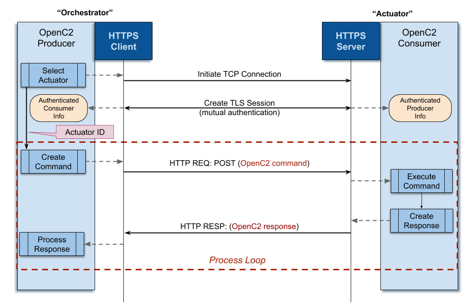

---
# Specification for Transfer of OpenC2 Messages via HTTPS Version 1.0
## Committee Specification 01
## 11 July 2019

#### This version:
https://docs.oasis-open.org/openc2/open-impl-https/v1.0/cs01/open-impl-https-v1.0-cs01.md (Authoritative) \
https://docs.oasis-open.org/openc2/open-impl-https/v1.0/cs01/open-impl-https-v1.0-cs01.html \
https://docs.oasis-open.org/openc2/open-impl-https/v1.0/cs01/open-impl-https-v1.0-cs01.pdf

#### Previous version:
https://docs.oasis-open.org/openc2/open-impl-https/v1.0/csprd02/open-impl-https-v1.0-csprd02.md (Authoritative) \
https://docs.oasis-open.org/openc2/open-impl-https/v1.0/csprd02/open-impl-https-v1.0-csprd02.html \
https://docs.oasis-open.org/openc2/open-impl-https/v1.0/csprd02/open-impl-https-v1.0-csprd02.pdf

#### Latest version:
https://docs.oasis-open.org/openc2/open-impl-https/v1.0/open-impl-https-v1.0.md (Authoritative) \
https://docs.oasis-open.org/openc2/open-impl-https/v1.0/open-impl-https-v1.0.html \
https://docs.oasis-open.org/openc2/open-impl-https/v1.0/open-impl-https-v1.0.pdf

#### Technical Committee:
[OASIS Open Command and Control (OpenC2) TC](https://www.oasis-open.org/committees/openc2/)

#### Chairs:
Joe Brule (jmbrule@nsa.gov), [National Security Agency](https://www.nsa.gov/) \
Duncan Sparrell (duncan@sfractal.com), [sFractal Consulting LLC](http://www.sfractal.com/)

#### Editor:
David Lemire (dave.lemire@g2-inc.com), [G2, Inc.](http://www.g2-inc.com/)

#### Related work:

This specification is related to:

_Open Command and Control (OpenC2) Language Specification Version 1.0_. Edited by Jason Romano and Duncan Sparrell. Latest version: https://docs.oasis-open.org/openc2/oc2ls/v1.0/oc2ls-v1.0.html. \
_Open Command and Control (OpenC2) Profile for Stateless Packet Filtering Version 1.0_. Edited by Joe Brule, Duncan Sparrell and Alex Everett. Latest version: https://docs.oasis-open.org/openc2/oc2slpf/v1.0/oc2slpf-v1.0.html.

#### Abstract:
Open Command and Control (OpenC2) is a concise and extensible language to enable the command and control of cyber defense components, subsystems and/or systems in a manner that is agnostic of the underlying products, technologies, transport mechanisms or other aspects of the implementation. HTTP over TLS is a widely deployed transfer protocol that provides an authenticated, ordered,  lossless delivery of uniquely-identified messages.  This document specifies the use of HTTP over TLS as a transfer mechanism for OpenC2 Messages.

#### Status:
This document was last revised or approved by the OASIS Open Command and Control (OpenC2) TC on the above date. The level of approval is also listed above. Check the "Latest version" location noted above for possible later revisions of this document. Any other numbered Versions and other technical work produced by the Technical Committee (TC) are listed at https://www.oasis-open.org/committees/tc_home.php?wg_abbrev=openc2#technical.

TC members should send comments on this specification to the TC's email list. Others should send comments to the TC's public comment list, after subscribing to it by following the instructions at the "Send A Comment" button on the TC's web page at https://www.oasis-open.org/committees/openc2/.

This specification is provided under the [Non-Assertion](https://www.oasis-open.org/policies-guidelines/ipr#Non-Assertion-Mode) Mode of the OASIS IPR Policy, the mode chosen when the Technical Committee was established. For information on whether any patents have been disclosed that may be essential to implementing this specification, and any offers of patent licensing terms, please refer to the Intellectual Property Rights section of the TC's web page (https://www.oasis-open.org/committees/openc2/ipr.php).

Note that any machine-readable content ([Computer Language Definitions](https://www.oasis-open.org/policies-guidelines/tc-process#wpComponentsCompLang)) declared Normative for this Work Product is provided in separate plain text files. In the event of a discrepancy between any such plain text file and display content in the Work Product's prose narrative document(s), the content in the separate plain text file prevails.

#### Citation format:
When referencing this specification the following citation format should be used:

**[OpenC2-HTTPS-v1.0]**

_Specification for Transfer of OpenC2 Messages via HTTPS Version 1.0_. Edited by David Lemire. 11 July 2019. OASIS Committee Specification 01. https://docs.oasis-open.org/openc2/open-impl-https/v1.0/cs01/open-impl-https-v1.0-cs01.html. Latest version: https://docs.oasis-open.org/openc2/open-impl-https/v1.0/open-impl-https-v1.0.html.

---

## Notices
Copyright © OASIS Open 2019. All Rights Reserved.

All capitalized terms in the following text have the meanings assigned to them in the OASIS Intellectual Property Rights Policy (the "OASIS IPR Policy"). The full [Policy](https://www.oasis-open.org/policies-guidelines/ipr) may be found at the OASIS website.

This document and translations of it may be copied and furnished to others, and derivative works that comment on or otherwise explain it or assist in its implementation may be prepared, copied, published, and distributed, in whole or in part, without restriction of any kind, provided that the above copyright notice and this section are included on all such copies and derivative works. However, this document itself may not be modified in any way, including by removing the copyright notice or references to OASIS, except as needed for the purpose of developing any document or deliverable produced by an OASIS Technical Committee (in which case the rules applicable to copyrights, as set forth in the OASIS IPR Policy, must be followed) or as required to translate it into languages other than English.

The limited permissions granted above are perpetual and will not be revoked by OASIS or its successors or assigns.

This document and the information contained herein is provided on an "AS IS" basis and OASIS DISCLAIMS ALL WARRANTIES, EXPRESS OR IMPLIED, INCLUDING BUT NOT LIMITED TO ANY WARRANTY THAT THE USE OF THE INFORMATION HEREIN WILL NOT INFRINGE ANY OWNERSHIP RIGHTS OR ANY IMPLIED WARRANTIES OF MERCHANTABILITY OR FITNESS FOR A PARTICULAR PURPOSE.

OASIS requests that any OASIS Party or any other party that believes it has patent claims that would necessarily be infringed by implementations of this OASIS Committee Specification or OASIS Standard, to notify OASIS TC Administrator and provide an indication of its willingness to grant patent licenses to such patent claims in a manner consistent with the IPR Mode of the OASIS Technical Committee that produced this specification.

OASIS invites any party to contact the OASIS TC Administrator if it is aware of a claim of ownership of any patent claims that would necessarily be infringed by implementations of this specification by a patent holder that is not willing to provide a license to such patent claims in a manner consistent with the IPR Mode of the OASIS Technical Committee that produced this specification. OASIS may include such claims on its website, but disclaims any obligation to do so.

OASIS takes no position regarding the validity or scope of any intellectual property or other rights that might be claimed to pertain to the implementation or use of the technology described in this document or the extent to which any license under such rights might or might not be available; neither does it represent that it has made any effort to identify any such rights. Information on OASIS' procedures with respect to rights in any document or deliverable produced by an OASIS Technical Committee can be found on the OASIS website. Copies of claims of rights made available for publication and any assurances of licenses to be made available, or the result of an attempt made to obtain a general license or permission for the use of such proprietary rights by implementers or users of this OASIS Committee Specification or OASIS Standard, can be obtained from the OASIS TC Administrator. OASIS makes no representation that any information or list of intellectual property rights will at any time be complete, or that any claims in such list are, in fact, Essential Claims.

The name "OASIS" is a trademark of [OASIS](https://www.oasis-open.org/), the owner and developer of this specification, and should be used only to refer to the organization and its official outputs. OASIS welcomes reference to, and implementation and use of, specifications, while reserving the right to enforce its marks against misleading uses. Please see https://www.oasis-open.org/policies-guidelines/trademark for above guidance.

---

## Table of Contents
-   [1 Introduction](#1-introduction)
    -   [1.1 IPR Policy](#11-ipr-policy)
    -   [1.2 Terminology](#12-terminology)
    -   [1.3 Normative References](#13-normative-references)
    -   [1.4 Non-Normative References](#14-non-normative-references)
    -   [1.5 Document Conventions](#15-document-conventions)
        -   [1.5.1 Naming Conventions](#151-naming-conventions)
        -   [1.5.2 Font Colors and Style](#152-font-colors-and-style)
    -   [1.6 Overview](#16-overview)
    -   [1.7 Goal](#17-goal)
    -   [1.8 Suitability](#18-suitability)
-   [2 Operating Model](#2-operating-model)
-   [3 Protocol Mappings](#3-protocol-mappings)
    -   [3.1 Layering Overview](#31-layering-overview)
    -   [3.2 General Requirements](#32-general-requirements)
        -   [3.2.1 Serialization and Content
            Types](#321-serialization-and-content-types)
        -   [3.2.2 HTTP Usage](#322-http-usage)
        -   [3.2.3 TLS Usage](#323-tls-usage)
        -   [3.2.4 Authentication](#324-authentication)
    -   [3.3 OpenC2 Consumer as HTTP/TLS
        Server](#33-openc2-consumer-as-httptls-server)
-   [4 Conformance](#4-conformance)
-   [Annex A. Acronyms](#annex-a-acronyms)
-   [Annex B. Examples](#annex-b-examples)
    -   [B.1 HTTP Request / Response Examples: Consumer as HTTP
        Server](#b1-http-request--response-examples-consumer-as-http-server)
        -   [B.1.1 Producer HTTP POST with OpenC2
            Command](#b11-producer-http-post-with-openc2-command)
        -   [B.1.2 Consumer HTTP Response with OpenC2
            Response](#b12-consumer-http-response-with-openc2-response)
-   [Annex C. Acknowledgments](#annex-c-acknowledgments)
-   [Annex D. Revision History](#annex-d-revision-history)

---

# 1 Introduction

_The content in this section is non-normative, except where it is marked normative._

OpenC2 is a suite of specifications that enables command and control of cyber defense systems and components. OpenC2 typically uses a request-response paradigm where a _Command_ is encoded by a _Producer_ (managing application) and transferred to a _Consumer_ (managed device or virtualized function) using a secure transfer protocol, and the Consumer can respond with status and any requested information.

OpenC2 allows the application producing the commands to discover the set of capabilities supported by the managed devices. These capabilities permit the managing application to adjust its behavior to take advantage of the features exposed by the managed device. The capability definitions can be easily extended in a noncentralized manner, allowing standard and non-standard capabilities to be defined with semantic and syntactic rigor.

## 1.1 IPR Policy
This specification is provided under the [Non-Assertion](https://www.oasis-open.org/policies-guidelines/ipr#Non-Assertion-Mode) Mode of the [OASIS IPR Policy](https://www.oasis-open.org/policies-guidelines/ipr), the mode chosen when the Technical Committee was established. For information on whether any patents have been disclosed that may be essential to implementing this specification, and any offers of patent licensing terms, please refer to the Intellectual Property Rights section of the TC's web page ([https://www.oasis-open.org/committees/openc2/ipr.php](https://www.oasis-open.org/committees/openc2/ipr.php)).

## 1.2 Terminology

_This section is normative._

* **Action**: The task or activity to be performed (e.g., 'deny').
* **Actuator**: The function performed by the Consumer that executes the Command (e.g., 'Stateless Packet Filtering').
* **Argument**: A property of a Command that provides additional information on how to perform the Command, such as date/time, periodicity, duration, etc.
* **Command**: A Message defined by an Action-Target pair that is sent from a Producer and received by a Consumer.
* **Consumer**: A managed device / application that receives Commands. Note that a single device / application can have both Consumer and Producer capabilities.
* **Message**: A content- and transport-independent set of elements conveyed between Consumers and Producers.
* **Producer**: A manager application that sends Commands.
* **Response**: A Message from a Consumer to a Producer acknowledging a Command or returning the requested resources or status to a previously received Command.
* **Specifier**: A property or field that identifies a Target or Actuator to some level of precision.
* **Target**: The object of the Action, i.e., the Action is performed on the Target (e.g., IP Address).

The key words "MUST", "MUST NOT", "REQUIRED", "SHALL", "SHALL NOT", "SHOULD", "SHOULD NOT", "RECOMMENDED", "NOT RECOMMENDED", "MAY", and "OPTIONAL" in this document are to be interpreted as described in [[RFC2119](#rfc2119)] and [[RFC8174](#rfc8174)] when, and only when, they appear in all capitals, as shown here.

A list of acronyms is provided in [Annex A](#annex-a-acronyms).


## 1.3 Normative References
###### [RFC2119]
Bradner, S., "Key words for use in RFCs to Indicate Requirement Levels", BCP 14, RFC 2119, DOI 10.17487/RFC2119, March 1997, <[http://www.rfc-editor.org/info/rfc2119](http://www.rfc-editor.org/info/rfc2119)>.
###### [RFC2818] 
Rescorla, E., "HTTP Over TLS", RFC 2818, DOI 10.17487/RFC2818, May 2000, <[https://www.rfc-editor.org/info/rfc2818](https://www.rfc-editor.org/info/rfc2818)>.
###### [RFC5246] 
Dierks, T. and E. Rescorla, "The Transport Layer Security (TLS) Protocol Version 1.2", RFC 5246, DOI 10.17487/RFC5246, August 2008, <[https://www.rfc-editor.org/info/rfc5246](https://www.rfc-editor.org/info/rfc5246)>.
###### [RFC7230] 
Fielding, R., Ed., and J. Reschke, Ed., "Hypertext Transfer Protocol (HTTP/1.1): Message Syntax and Routing", RFC 7230, DOI 10.17487/RFC7230, June 2014, <https://www.rfc-editor.org/info/rfc7230>.
###### [RFC7231] 
Fielding, R., Ed., and J. Reschke, Ed., "Hypertext Transfer Protocol (HTTP/1.1): Semantics and Content", RFC 7231, DOI 10.17487/RFC7231, June 2014, <https://www.rfc-editor.org/info/rfc7231>.
###### [RFC7235] 
Fielding, R., Ed., and J. Reschke, Ed., "Hypertext Transfer Protocol (HTTP/1.1): Authentication", RFC 7235, DOI 10.17487/RFC7235, June 2014, <https://www.rfc-editor.org/info/rfc7235>.
###### [RFC7540]
Belshe, M., Peon, R., and M. Thompson, Ed., "Hypertext Transfer Protocol Version 2 (HTTP/2)", RFC 7540, DOI 10.17487/RFC7540, May 2015, <[https://www.rfc-editor.org/info/rfc7540](https://www.rfc-editor.org/info/rfc7540)>.
###### [RFC8174]
Leiba, B., "Ambiguity of Uppercase vs Lowercase in RFC 2119 Key Words", BCP 14, RFC 8174, DOI 10.17487/RFC8174, May 2017, <[http://www.rfc-editor.org/info/rfc8174](http://www.rfc-editor.org/info/rfc8174)>.
###### [RFC8446]
Rescorla, E., "The Transport Layer Security (TLS) Protocol Version 1.3", RFC 8446, DOI 10.17487/RFC8446, August 2018, <[http://www.rfc-editor.org/info/rfc8446](http://www.rfc-editor.org/info/rfc8446)>
###### [OpenC2-Lang-v1.0]
_Open Command and Control (OpenC2) Language Specification Version 1.0_. Edited by Jason Romano and Duncan Sparrell. Latest version: http://docs.oasis-open.org/openc2/oc2ls/v1.0/oc2ls-v1.0.html.

## 1.4 Non-Normative References
###### [RFC3205]
Moore, K., "On the use of HTTP as a Substrate", BCP 56, RFC 3205, DOI 10.17487/RFC3205, February 2002, <https://www.rfc-editor.org/info/rfc3205>.
###### [RFC7525]
Sheffer, Y., Holz, R., and P. Saint-Andre, "Recommendations for Secure Use of Transport Layer Security (TLS) and Datagram Transport Layer Security (DTLS)", BCP 195, RFC 7525, DOI 10.17487/RFC7525, May 2015, <https://www.rfc-editor.org/info/rfc7525>.
###### [RFC8259]
Bray, T., ed., "The JavaScript Object Notation (JSON) Data Interchange Format", STD 90, RFC 8259, DOI 10.17487/RFC8259, December 2017, http://www.rfc-editor.org/info/rfc8259
###### [SLPF]
_Open Command and Control (OpenC2) Profile for Stateless Packet Filtering Version 1.0_. Edited by Joe Brule, Duncan Sparrell and Alex Everett. Latest version: http://docs.oasis-open.org/openc2/oc2slpf/v1.0/oc2slpf-v1.0.html 
###### [IACD]
M. J. Herring, K. D. Willett, "Active Cyber Defense: A Vision for Real-Time Cyber Defense," Journal of Information Warfare, vol. 13, Issue 2, p. 80, April 2014.<https://www.semanticscholar.org/paper/Active-Cyber-Defense-%3A-A-Vision-for-Real-Time-Cyber-Herring-Willett/7c128468ae42584f282578b86439dbe9e8c904a8>.<br><br>Willett, Keith D., "Integrated Adaptive Cyberspace Defense: Secure Orchestration", International Command and Control Research and Technology Symposium, June 2015 <https://www.semanticscholar.org/paper/Integrated-Adaptive-Cyberspace-Defense-%3A-Secure-by-Willett/a22881b8a046e7eab11acf647d530c2a3b03b762>.

## 1.5 Document Conventions
### 1.5.1 Naming Conventions
* [[RFC2119]](#rfc2119)/[[RFC8174]](#rfc8174) key words (see [Section 1.2](#12-terminology)) are in all uppercase.
* All property names and literals are in lowercase, except when referencing canonical names defined in another standard (e.g., literal values from an IANA registry).
* Words in property names are separated with an underscore (_), while words in string enumerations and type names are separated with a hyphen (-).
* The term "hyphen" used here refers to the ASCII hyphen or minus character, which in Unicode is "hyphen-minus", U+002D.

### 1.5.2 Font Colors and Style
The following color, font and font style conventions are used in this document:

* A fixed width font is used for all type names, property names, and literals.
* Property names are in bold style – **'created_at'**.
* All examples in this document are expressed in JSON. They are in fixed width font, with straight quotes, black text and a light shaded background, and 4-space indentation. JSON examples in this document are representations of JSON Objects. They should not be interpreted as string literals. The ordering of object keys is insignificant. Whitespace before or after JSON structural characters in the examples are insignificant [[RFC8259]](#rfc8259).
* Parts of the example may be omitted for conciseness and clarity. These omitted parts are denoted with the ellipses (...).

Example:

```
HTTP/1.1 200 OK
Date: Wed, 19 Dec 2018 22:15:00 GMT
Content-type: application/openc2-cmd+json;version=1.0
X-Request-ID: 0e3d8fa8-0bae-4055-a341-9c97b4f328f7
{
  "action": "deny",
  "target": {
    "file": {
      "hashes": {
        "sha256": "22fe72a34f006ea67d26bb7004e2b6941b5c3953d43ae7ec24d41b1a928a6973"
      }
    }
  }
}
```

## 1.6 Overview
In general, there are two types of participants involved in the exchange of OpenC2 Messages, as depicted in Figure 1-1:
1. **Producers**: A Producer is an entity that creates Commands to provide instruction to one or more systems to act in accordance with the content of the Command. A Producer may receive and process Responses in conjunction with a Command.
2. **Consumers**: A Consumer is an entity that receives and may act upon a Command. A Consumer may create Responses that provide any information captured or necessary to send back to the Producer.


**Figure 1-1. OpenC2 Message Exchange**

OpenC2 is a suite of specifications for Producers and Consumers to command and execute cyber defense functions. These specifications include the OpenC2 Language Specification, Actuator Profiles, and Transfer Specifications. The OpenC2 Language Specification and Actuator Profile specifications focus on the language content and meaning at the Producer and Consumer of the Command and Response while the transfer specifications focus on the protocols for their exchange.
* The OpenC2 Language Specification [[OpenC2-Lang-v1.0](#openc2-lang-v10)] provides the semantics for the essential elements of the language, the structure for Commands and Responses, and the schema that defines the proper syntax for the language elements that represents the Command or Response.
* **OpenC2 Actuator Profiles** specify the subset of the OpenC2 language relevant in the context of specific Actuator functions. Cyber defense components, devices, systems and/or instances may (in fact are likely to) implement multiple Actuator profiles. Actuator profiles extend the language by defining Specifiers that identify the Actuator to the required level of precision. Actuator Profiles may define Command Arguments and Targets that are relevant and/or unique to those Actuator functions.
* **OpenC2 Transfer Specifications** utilize existing protocols and standards to implement OpenC2 in specific environments. These standards are used for communications and security functions beyond the scope of the language, such as message transfer encoding, authentication, and end-to-end transport of OpenC2 Messages.

The OpenC2 Language Specification defines a language used to compose Messages for command and control of cyber defense systems and components. A Message consists of a header and a payload (_defined_ as a Message body in the OpenC2 Language Specification Version 1.0 and _specified_ in one or more Actuator profiles).

The language defines two payload structures:

1. **Command**: An instruction from one system known as the Producer, to one or more systems, the Consumer(s), to act on the content of the Command.
2. **Response**: Any information sent back to the Producer as a result of the Command.

OpenC2 implementations integrate the related OpenC2 specifications described above with related industry specifications, protocols, and standards. Figure 1-2 depicts the relationships among OpenC2 specifications, and their relationships to other industry standards and environment-specific implementations of OpenC2. Note that the layering of implementation aspects in the diagram is notional, and not intended to preclude any particular approach to implementing the needed functionality (for example, the use of an application-layer message signature function to provide message source authentication and integrity).


**Figure 1-2. OpenC2 Documentation and Layering Model**

OpenC2 is conceptually partitioned into four layers as shown in Table 1-1.

**Table 1-1. OpenC2 Protocol Layers**

| Layer | Examples |
| :--- | :--- |
| Function-Specific Content | Actuator Profiles<br>([[OpenC2-SLPF-v1.0]](#openc2-slpf-v10), ...) |
| Common Content | OpenC2 Language Specification<br>([[OpenC2-Lang-v1.0]](#openc2-lang-v10)) |
| Message | Transfer Specifications<br>([[OpenC2-HTTPS-v1.0]](#openc2-https-v10), OpenC2-over-CoAP, ...) |
| Secure Transport | HTTPS, CoAP, MQTT, OpenDXL, ... |

* The **Secure Transport** layer provides a communication path between the Producer and the Consumer. OpenC2 can be layered over any standard transfer protocol.
* The **Message** layer provides a transfer- and content-independent mechanism for conveying Messages. A transfer specification maps transfer-specific protocol elements to a transfer-independent set of message elements consisting of content and associated metadata.
* The **Common Content** layer defines the structure of Commands and Responses and a set of common language elements used to construct them.
* The **Function-specific Content** layer defines the language elements used to support a particular cyber defense function. An Actuator profile defines the implementation conformance requirements for that function. Producers and Consumers will support one or more profiles.

The components of a Command are an Action (what is to be done), a Target (what is being acted upon), an optional Actuator (what is performing the command), and Command Arguments, which influence how the Command is to be performed. An Action coupled with a Target is sufficient to describe a complete Command. Though optional, the inclusion of an Actuator and/or Command Arguments provides additional precision to a Command.

The components of a Response are a numerical status code, an optional status text string, and optional results. The format of the results, if included, depend on the type of Response being transferred.

## 1.7 Goal
The goal of the OpenC2 Language Specification is to provide a language for interoperating between functional elements of cyber defense systems. This language used in conjunction with OpenC2 Actuator Profiles and OpenC2 Transfer Specifications allows for vendor-agnostic cybertime response to attacks.

The Integrated Adaptive Cyber Defense (IACD) framework defines a collection of activities, based on the traditional OODA (Observe–Orient–Decide–Act) Loop [[IACD]](#iacd):

* Sensing:  gathering of data regarding system activities
* Sense Making:  evaluating data using analytics to understand what's happening
* Decision Making:  determining a course-of-action to respond to system events
* Acting:  Executing the course-of-action

The goal of OpenC2 is to enable coordinated defense in cyber-relevant time between decoupled blocks that perform cyber defense functions. OpenC2 focuses on the Acting portion of the IACD framework; the assumption that underlies the design of OpenC2 is that the sensing/analytics have been provisioned and the decision to act has been made. This goal and these assumptions guide the design of OpenC2:

* **Technology Agnostic:**  The OpenC2 language defines a set of abstract atomic cyber defense actions in a platform and implementation agnostic manner
* **Concise:**  A Command is intended to convey only the essential information required to describe the action required and can be represented in a very compact form for communications-constrained environments
* **Abstract:**  Commands and Responses are defined abstractly and can be encoded and transferred via multiple schemes as dictated by the needs of different implementation environments
* **Extensible:**  While OpenC2 defines a core set of Actions and Targets for cyber defense, the language is expected to evolve with cyber defense technologies, and permits extensions to accommodate new cyber defense technologies.

## 1.8 Suitability
This document specifies the use of Hypertext Transfer Protocol (HTTP) over Transport Layer Security (TLS) as a transfer mechanism for OpenC2 Messages; 
this HTTP/TLS layering is typically referred to as HTTPS [[RFC2818](#rfc2818)]. 
As described in [[RFC3205](#rfc3205)], HTTP has become a common "substrate" for information transfer for other application-level protocols. 
The broad availability of HTTP makes it a useful option for OpenC2 Message transport in support of prototyping, interoperability testing, and for operational use in environments where appropriate security protections can be provided. 
Similarly, TLS is a mature and widely-used protocol for securing information transfers in TCP/IP network environments. 
This specification provides guidance to the OpenC2 implementation community when utilizing HTTPS for OpenC2 Message transport. 
It includes guidance for selection of TLS versions and options suitable for use with OpenC2.

This OpenC2 over HTTPS transfer specification is suitable for operational environments where: 

* Connectivity between OpenC2 Producers and OpenC2 Consumers is: 
    * Highly available, with infrequent network outages
    * Of sufficient bandwidth that no appreciable message delays or dropped packets are experienced 
* In-band negotiation of a connection initiated by either Producer or Consumer is possible without requiring an out-of-band signaling network.
* The overhead of HTTPS is acceptable (e.g., multiple OpenC2 Command / Response exchanges can be passed through a single HTTPS connection).

An additional application for this transfer specification is interoperability test environments.

---
# 2 Operating Model
_This section is non-normative._

This section describes the operating model used when transferring OpenC2 Commands and Responses using HTTPS. 

Each endpoint of an OpenC2-over-HTTPS interaction has both an OpenC2 role and an HTTP function. 
OpenC2 Consumers will be HTTP listeners so that they can accept connections and receive unsolicited Commands from OpenC2 Producers. 
OpenC2 Producers act as 'HTTP clients' and transmit Commands to Consumers.

Figure 2 illustrates the Producer / Consumer interactions. 
A Producer that needs to send OpenC2 Commands initiates a TCP connection to the Consumer. 
Once the TCP connection is created, a TLS session is initiated to authenticate the endpoints 
and provide connection confidentiality. The Producer can then issue OpenC2 Commands by 
sending HTTP requests using the POST method, with Consumer OpenC2 Responses returned in the HTTP response. 



**Figure 2 -- OpenC2 Producer / Consumer Interactions**

---
# 3 Protocol Mappings
The section defines the requirements for using HTTP and TLS with OpenC2, including general requirements and protocol mappings for the operating configuration described in Section 2.

## 3.1 	Layering Overview
When using HTTPS for OpenC2 Message transfer, the layering model is:

| Layer | Description |
|:---|:---|
| OpenC2 Content | The OpenC2 Language Specification defines the overall OpenC2 language, and the Actuator Profile(s) implemented by any particular endpoint scopes the OpenC2 actions, targets, arguments, and specifiers that apply when commanding that type of Actuator.  |
| Serialization | Serialization converts internal representations of OpenC2 content into a form that can be transmitted and received. The OpenC2 default serialization is JSON. |
| Message | The message layer provides a content- and transport-independent mechanism for conveying requests and responses.  A Message consists of content plus a set of meta items such as content type and version, sender, timestamp, and correlation id.  This layer maps the transport-independent definition of each message element to its transport-specific on-the-wire representation.|
| HTTP | The HTTP layer is responsible for conveying request and response Messages, as described in this specification. |
| TLS | The TLS layer is responsible for authentication of connection endpoints and confidentiality and integrity of transferred Messages.  |
| Lower Layer Transport | The lower protocol layers are responsible for end-to-end delivery of Messages. TCP/IP is the most common suite of lower layer protocols used with HTTPS. |

## 3.2 General Requirements
This section defines serialization, HTTP, and TLS requirements.

### 3.2.1 Serialization and Content Types
While the OpenC2 language is agnostic of serialization, when transferring OpenC2 Messages over HTTP/TLS as described in this specification, the default JSON serialization described in [[OpenC2-Lang-v1.0](#openc2-lang-v10)] MUST be supported.

As described in [OpenC2-Lang-v1.0], transfer protocols must convey message elements. Two content types are defined here to support that requirement:

* OpenC2 Command:
    * msg_type: "request"
    * content_type: application/openc2-cmd+json;version=1.0
* OpenC2 Response: 
    * msg_type: "response"
    * content_type: application/openc2-rsp+json;version=1.0 

When OpenC2 Command Messages sent over HTTPS use the default JSON serialization the message MUST specify the content type "application/openc2-cmd+json;version=1.0". 

When OpenC2 Response Messages sent over HTTPS use the default JSON serialization the message MUST specify the content type "application/openc2-rsp+json;version=1.0". 

### 3.2.2 HTTP Usage
OpenC2 Consumers MUST be HTTP listeners, to implement the operating model described in [Section 2](#2-operating-model). 
OpenC2 Consumers acting as HTTP listeners SHOULD listen on port 443, the registered port for HTTPS.

OpenC2 endpoints MUST implement all HTTP functionality required by this specification in accordance with HTTP/1.1 ([[RFC7230](#rfc7230)], _et. al._). As described in the Table 3-1, the only HTTP request method utilized is  POST. 


| Utilized?  | HTTP Methods |
|:---:|:---|
| Yes | POST |
| No | GET, HEAD, PUT, DELETE, CONNECT, OPTIONS, TRACE | 

**Table 3-1: HTTP Method Use**

Each HTTP message body MUST contain only a single OpenC2 Command or Response message. This does not preclude a Producer and Consumer exchanging multiple OpenC2 Command and Response Messages over time during a single HTTPS session. Depending on the set-up, a server and client can have multiple connections, but a sequence of OpenC2 interactions can spread over multiple connections. In some cases the connection may drop, but the session remains open (in an idle state).

All HTTP request and response messages containing OpenC2 payloads SHOULD include the "Cache-control:" header with a value of "no-store". The "no-store" request directive indicates that a cache MUST NOT store any part of either this request or any response to it. OpenC2 Messages are intended to be exchanged in cyber relevant time and not reused, therefore caching is inappropriate".

The HTTP X-Request-ID header SHOULD be populated with the request_id string supplied by the Producer.

### 3.2.3 TLS Usage
HTTPS, the transmission of HTTP over TLS, is specified in Section 2 of [[RFC2818](#rfc2818)]. OpenC2 endpoints MUST accept TLS Version 1.2 [[RFC5246](#rfc5246)] connections or higher for confidentiality, identification, and authentication when sending OpenC2 Messages over HTTPS, and SHOULD accept TLS Version 1.3 [[RFC8446](#rfc8446)] or higher connections.

OpenC2 endpoints MUST NOT support any version of TLS prior to v1.2 and MUST NOT support any version of Secure Sockets Layer (SSL). 

The implementation and use of TLS SHOULD align with the best currently available security guidance, such as that provided in [[RFC7525](#rfc7525)]/BCP 195.

The TLS session MUST use non-NULL ciphersuites for authentication, integrity, and confidentiality (NULL ciphersuites do not provide confidentiality). Sessions MAY be renegotiated within these constraints.

OpenC2 endpoints supporting TLS v1.2 MUST NOT use any of the blacklisted ciphersuites identified in Appendix A of [[RFC7540](#rfc7540)]. 

OpenC2 endpoints supporting TLS v1.3 MUST NOT implement zero round trip time resumption (0-RTT). 
Requests sent as part of 0-RTT resumption are vulnerable to a replay attack.

### 3.2.4 Authentication

Each participant in an OpenC2 communication MUST authenticate the other participant.

## 3.3 OpenC2 Consumer as HTTP/TLS Server
This section defines HTTP requirements that apply when the OpenC2 Consumer is the HTTP server.

As the OpenC2 Consumer is the HTTP server, the Producer initiates a 
connection to a specific Consumer and directly transmits OpenC2 Messages containing Commands; 
the HTTP POST method is used, with the OpenC2 Command body contained in the POST body.

The following HTTP request headers MUST be populated when transferring OpenC2 Commands:

* Host:  host name of HTTP server:listening port number (if other than port 443)
* Content-type:  application/openc2-cmd+json;version=1.0 (when using the default JSON serialization)
* Accept: application/openc2-rsp+json;version=1.0 (when using the default JSON serialization)

The following HTTP request header SHOULD be populated when transferring OpenC2 Commands:
* X-Request-ID: if a request_id is supplied by the Producer, the supplied value SHOULD be placed in the X-Request-ID header

The following HTTP response headers MUST be populated when transferring OpenC2 Responses:	

* Content-type: application/openc2-rsp+json;version=1.0 (when using the default JSON serialization)
* X-Request-ID: if the X-Request-ID header was populated in the HTTP POST containing the OpenC2 Command, the X-Request-ID header in the Response MUST be populated with the value that was received in the POST

The following HTTP request and response headers SHOULD be populated when transferring OpenC2 Commands and Responses when the Consumer is the HTTP/TLS server:

* Date: date-time in the preferred IMF-fixdate format as 
defined by Section 7.1.1.1 of RFC 7231; 
the conditions for populating the Date: 
header specified in Section 7.1.1.2 of RFC 7231 SHALL be followed 


Example messages can be found in Annex B, section B.1.


---
# 4 Conformance

A conformant implementation of this transfer specification MUST:

1. Support JSON serialization as specified in [Section 3.2.1](#321-serialization-and-content-types).
2. Transfer OpenC2 Messages using the content types defined in [Section 3.2.1](#321-serialization-and-content-types) appropriately, as specified in Section [3.3](#33-openc2-consumer-as-httptls-server).
3. Listen for HTTPS connections as specified in [Section 3.2.2](#322-http-usage).
4. Use HTTP POST method as specified in Sections [3.2.2](#322-http-usage), and [3.3](#33-openc2-consumer-as-httptls-server), and no other HTTP methods.
5. Ensure HTTP request and response messages only contain a single OpenC2 message, as specified in [Section 3.2.2](#322-http-usage).
6. Implement TLS in accordance with the requirements and restrictions specified in Sections [3.2.3](#323-tls-usage).
7. Employ HTTP methods to send and receive OpenC2 Messages as specified in Section [3.3](#33-openc2-consumer-as-httptls-server).
8. Employ only the HTTP response codes specified in [[OpenC2-Lang-v1.0](#openc2-lang-v10)], Section 3.3.2.1.
9. Support authentication of remote parties as specified in Section [3.2.4](#324-authentication)
10. Instantiate the message elements defined in Table 3-1 of [[OpenC2-Lang-v1.0](#openc2-lang-v10)] as follows:


| Name | HTTPS Implementation |
|:---|:---|
| content | JSON serialization of OpenC2 Commands and Responses carried in the HTTP message body |
| content_type /<br>msg_type | Combined and carried in the HTTP Content-type and Accepted headers:<br>    Command:  application/openc2-cmd+json;version=1.0<br>    Response:  application/openc2-rsp+json;version=1.0 |
| status | Numeric status code supplied by OpenC2 Consumers is carried in the HTTP response start line status code.  |
| request_id | String value originally supplied by the OpenC2 Producer is carried in HTTP X-Request-ID header. |
| created | Carried in the HTTP Date header in the preferred IMF-fixdate format as defined by Section 7.1.1.1 of RFC 7231. |
| from | Populated with the authenticated identity of the peer entity, consistent with the configured authentication scheme. |
| to | Carried in the HTTP Host header; this specification assumes that the Provider will supply a single destination. |

**Table 4-1 - Message Element Implementation**

---
# Annex A. Acronyms

_This section is non-normative._

| Term | Expansion |
|:---|:---|
| 0-RTT | Zero Round Trip Time |
| API | Application Programming Interface |
| HTTP | Hypertext Transfer Protocol |
| HTTPS | HTTP over TLS |
| IETF | Internet Engineering Task Force |
| IPR | Intellectual Property Rights |
| JSON | JavaScript Object Notation |
| RFC | Request For Comment |
| RID | Real-time Inter-network Defense |
| TC | Technical Committee |
| TCP | Transmission Control Protocol |
| TLS | Transport Layer Security |

---
# Annex B. Examples
_This section is non-normative._

OpenC2 Messages consist of a set of "message elements" defined in Section 3.2 of [[OpenC2-Lang-v1.0](#openc2-lang-v10)]. Table 4-1 of this specification defines how the message elements are handled with HTTPS transfer. Broadly speaking the message content (i.e., Commands and Responses) is carried in the HTTP message body while the remaining elments are handled in HTTP headers. The example Messages below illustrate how this is handled in practice.

A Request-URI ending in /openc2 is used in all example HTTP requests.

## B.1 HTTP Request / Response Examples: Consumer as HTTP Server
This section presents the HTTP message structures used when the OpenC2 Consumer acts as the HTTP listener.

### B.1.1 Producer HTTP POST with OpenC2 Command
Example message:

```
POST /openc2 HTTP/1.1
Host: oc2consumer.company.net
Content-type: application/openc2-cmd+json;version=1.0
Date: Wed, 19 Dec 2018 22:15:00 GMT
X-Request-ID: d1ac0489-ed51-4345-9175-f3078f30afe5

{	
	"action": ...
	"target": …
	"args": ...
}
```

### B.1.2 Consumer HTTP Response with OpenC2 Response
Example message:

```
HTTP/1.1 200 OK
Date: Wed, 19 Dec 2018 22:15:10 GMT
Content-type: application/openc2-rsp+json;version=1.0
X-Request-ID: d1ac0489-ed51-4345-9175-f3078f30afe5

{	
	"status": 200
	"status_text": ...
	"results": { ...
}
```

---
# Annex C. Acknowledgments
The Implementation Considerations Subcommittee was tasked by the OASIS Open Command and Control Technical Committee (OpenC2 TC) which at the time of this submission, had 132 members.  The editor wishes to express their gratitude to the members of the OpenC2 TC. 

The following individuals are acknowledged for providing comments, suggested text, and/or participation in CSD ballots or face-to-face meetings:

* Michelle Barry, AT&T
* Brian Berliner, Symantec
* Joe Brule, National Security Agency
* Trey Darley, New Context Services, Inc.
* David Darnell, Systrends
* Travis Farral, Anomali
* Andy Gray, ForeScout
* John-Mark Gurney, New Context Services, Inc.
* Pavel Gutin, G2, Inc.
* David Hamilton, AT&T
* April Jackson, Praxis Engineering
* Sridhar Jayanthi, Polylogyx LLC
* Bret Jordan, Symantec
* Takahiro Kakumaru, NEC Corporation
* David Kemp, National Security Agency
* Lauri Korts-Pärn, NECAM
* Anthony Librera, AT&T
* Danny Martinez, G2, Inc.
* Lisa Mathews, National Security Agency
* Jim Meck, Fireeye
* Efrain Ortiz, Symantec Corp.
* Daniel Riedel, New Context Services, Inc.
* Nirmal Rajarathnam, ForeScout
* Chris Ricard, FS-ISAC
* Jason Romano, National Security Agency
* Philip Royer, Splunk Inc.
* Duane Skeen, Northrop Grumman
* Duncan Sparrell, sFractal Consulting LLC
* Michael Stair, AT&T
* Andrew Storms, New Context Services, Inc.
* Gerald Stueve, Fornetix
* Allan Thomson, LookingGlass Cyber Solutions
* Bill Trost, AT&T
* Ryan Trost, ThreatQuotient
* Drew Varner, NineFX
* Jason Webb, LookingGlass Cyber Solutions
* Sounil Yu, Bank of America
* David Webber, Huawei

---
# Annex D. Revision History
| Revision | Date | Editor | Changes Made |
|:---|:---|:---|:---|
| v1.0-wd01-wip | 6/15/2018 | Lemire | Initial working draft |
| v1.0-wd01-wip | 6/29/2018 | Lemire | Added Suitability section (1.6), responded to SC member comments |
| v1.0-wd01-wip | 7/20/2018 | Lemire | Additional responses to member comments; formatting clean-up for easier conversion to Markdown. |
| v1.0-wd01-wip | 8/9/2018 | Lemire | Implementing feedback from the July 2018 face-to-face meeting and resolving other comments to reach WD01 version to submit for CSD ballot. |
| v1.0-wd02-wip | 8/24/2018 | Lemire | Various edits to clarify interactions when the producer is HTTP listener; other edits and cleanup in response to document comments and Slack forum discussions. |
| v1.0-wd02-wip | 8/29/2018 | Lemire | 1) Adjustments to content type definitions to distinguish commands and responses; <br>2) Made corresponding adjustments to message flow descriptions and sample messages.<br>3) Added acknowledgements. |
| v1.0-wd02-wip | 8/30/2018 | Lemire | Inserted proposed replacements for sequence diagrams (Figures 2 and 3). |
| v1.0-wd02-wip | 8/31/2018 | Lemire | 1) Inserted initial draft conformance language (section 4).<br>2) Revised Section 1 content for greater consistency with related OpenC2 specifications.<br>3) Revised section 2.1 to merge proposed endpoint role descriptions<br>4) General edit for formatting, readability, consistency, etc. |
| v1.0-wd02-wip | 9/11/2018 | Lemire | 1) Reviewed and accepted / rejected comments.<br>2) Added placeholders for addressing use of "From" field.<br>3) Added statements about using Cache-control |
| v1.0-wd02-wip | 9/17/2018 | Lemire | 1) Added table to conformance section specifying mapping of Language Spec message elements.<br>2) Clarified certificate mutual authentication requirement.<br>3) Removed language about unsolicited responses from Consumers<br>4) Numbered the conformance items |
| v1.0-wd02-wip | 9/17/2018 | Lemire | 1) Removed used of the HTTP "From:" field, and mapped the OpenC2 "from" message element to the authenticated identity of the peer entity<br>2) Updated examples to remove HTTP From: |
| v1.0-wd02-wip | 9/19/2018 | Lemire | 1) Final clean-up of residual comments and edits to create WD02 package for CSD ballot.<br>2) Renamed document to WD03-wip  |
| v1.0-wd03-wip | 10/15/2018 | Lemire | 1) Reorganized section 1 to align with other OpenC2 specifications<br>2) Reworded section 3.2.1 to properly use MUST / SHALL language<br>3) Clarified requirements wording section 3.2.3 to better indicate TLS version requirements and preferences, and authentication requirements.<br>4) Updated Table 4-1 to align with changes to Language Specification Table 3-1. |
| v1.0-wd03-wip | 10/16/2018 | Lemire | 1) Final clean-up of residual edits to create WD03 package for CSD approval and release for public review. |
| v1.0-wd03-wip | 3/27/2019 | Lemire | Resolution of issues from public review 1. |
| v1.0-wd03-wip | 3/28/2019 | Lemire | Incremented WD version number to 05 prior to CSD ballot to eliminate ambiguity. |
| v1.0-wd06-wip | 5/14/2019 | Lemire | Resolution of issues from public review 2 and adjustments for consistency across the suite of specifications. |
